## Contents
|No|Topics|
|---:|:---|
|1.|Programme's Accuracy|
|2.|Code Optimization|

## Program's Accuracy
- This topic will describe the following:
1. Preparation of file sample. 
2. Output's accuracy result. 

## Preparation of File Sample
1)Sample file are prepared as FASTQ format. 

2)In each sample file, there are 5000 read of sequence, (120 bases/read of sequence):
<table>
    + first 1000 sequence         : sequence + adapter sequence (20 bases of 
                                    adapter sequence)
    + the following 3000 sequence : sequence WITHOUT adapter sequence
    + last 1000 sequence          : sequence + adapter sequence (20 bases of 
                                    adapter sequence)
  </table>

## Preparation of File Sample
3)Refer the following Figure for graphical explanation:
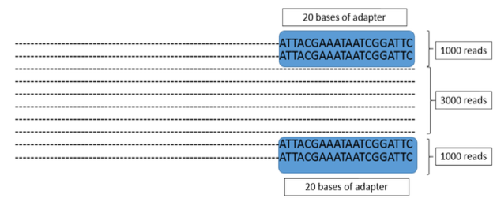

<p5>Number of reads with adapter and without adapter for each FASTQ file</p5>

## Preparation of File Sample
4)5 type of FASTQ file was created which include the following characteristics:

+ File1:  100% overlap between read 1 and read 2
    
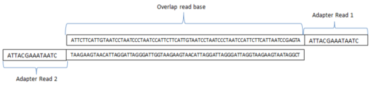
    
## Preparation of File Sample

+ File2:  75% overlap between read 1 and read 2
    
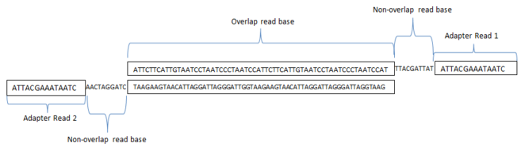

+ File3:  50% overlap between read 1 and read 2
    
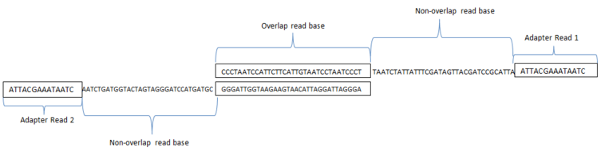

    
## Preparation of File Sample
+ File4:  25% overlap between read 1 and read 2
    
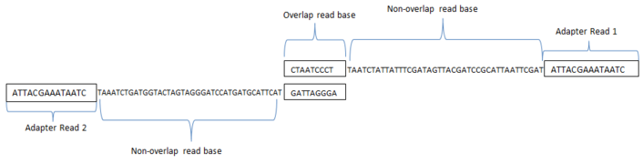

+ File5:  0% overlap between read 1 and read 2   
    
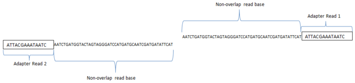

## Output's accuracy Result

|percentage of overlap sequence (%)|number of adapter detected (/20)   	| percentage of output's accuracy (%) 	|Adapter Detected (ATTACGAAATAATCGGATTC) |   
|:---	            |:---	                                |:---	                      |:---                                    |
| 100  	          |   20	                              |  100 	                    |ATTACGAAATAATCGGATTC                    |
|   75	          |   0	                                |   0	                      |Confidence level could not achieved     |
|   50	          |   0	                                |   0	                      |Confidence level could not achieved     |
|   25            |   15	                              |  75 	                    |ATTACGAAATAATCG                         |
|   0             |   0                                 |   0                       |Confidence level could not achieved     |

## Code Optimization
## Original code          vs         Edited code
<table>
<tr>
<th>original code</th>
<th>edited code</th>
</tr>
<tr>
<td>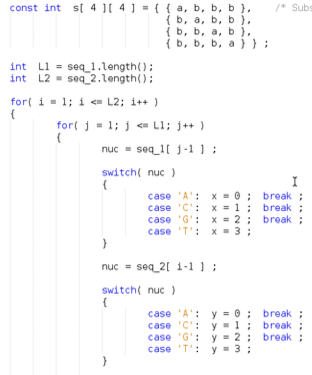</th>
<td>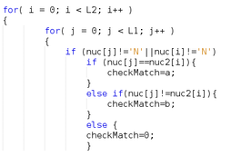</th>
</tr>
<tr>
<td>Checking match/mismatch score between 2 base using switch statement</th>
<td>Checking match/mismatch score between 2 base using if else statement</th>
</tr>
</table>

## Original code vs Edited code

<table>
<tr>
<th>original code</th>
<th>edited code</th>
</tr>

<tr>
<td>
F[ i+1 ][ j+1 ] = max( fU, fD,  
fL, ptr ) ;

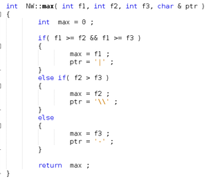</th>
<td>F[ i+1 ][ j+1 ] = max(max(fU, fD),fL);</th>
</tr>

<tr>
<td>Find maximum score using user-define function</th>
<td>Find maximum score using Build-in function.</th>
</tr>
</table>

## Original code vs Edited code

<table>
<tr>
<th>original code</th>
<th>edited code</th>
</tr>

<tr>
<td>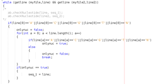</th>
<td>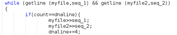</th>
</tr>

<tr>
<td>Filtrate the read sequence from FASTQ format using first character comparison</th>
<td>Filtrate the read sequence from FASTQ format using line count</th>
</tr>
</table>

## Result of Code Optimization
1.This table show the time taken for the programme to complete the process for each improvement's code: 

|Description|Change Done|User Time(sec)|System Time(sec)|Real Time(sec)|
|:--|:--|:--|:--|:--|
||original code by Rayan|16.965|0.056|17.041|
|Finding Match/Mismatch score|Use if else method rather than switch method|6.716|0.028|6.775|
|Finding maximum value between scoring matrix (fU/fD/fL)|use built-in max function to find maximum value rather than user-define max function|5.056|0.03|5.115|

## Result of Code Optimization
|Description|Change Done|User Time(sec)|System Time(sec)|Real Time(sec)|
|:--|:--|:--|:--|:--|
|Filter read sequence from FASTQ file|Use count line method rather than comparing the first character of each line|4.408|0.04|5.4458|

## Graph code change vs time
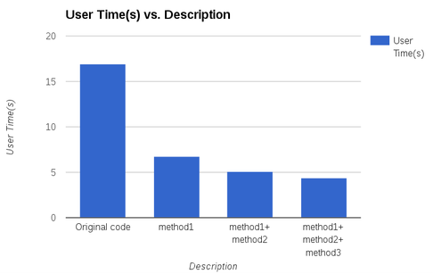

